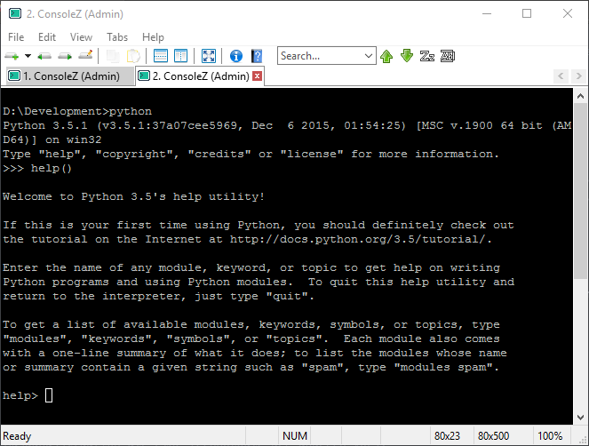

Assignments
=====================
- 25 Punkte gibt es in Summe
- 12: Punkte Data Science
- 12: Punkte Data Engineering
- 1 Punkt: Form der Abgabe

## Form
>1 Punkt für Abgabe via Github. Hausübung ist auf Github hochgeladen und ein Link zum Repository
verschickt. Bitte bei jedem Punkt, wo Text zu schreiben, maximal fünf Zeilen schreiben.
Data	Engineering

## Assignment	1: Big	Data in	Ihrem	Umfeld (4 Punkte)
### 1.1	(2	Punkte)
>Schauen Sie sich in Ihrem Umfeld um. FH Technikum oder Ihr Job. Nennen Sie mindestens ein
Beispiel für Daten, die schemalos (unstrukturiert) sind und mindestens ein Bespiel für Daten, die
strukturiert (schematisch) sind.

**Schemalos:**
In unserem aktuellen Projekt (Job) implementieren wir eine Anwendung zum erfassen und Auswerten von Fahrzeugmodelldaten. Dabei handelt es sich um Marktdaten. Berücksichtigt werden verschiedene Konfigurationen (oder auch Zusatzausstattungen) und deren Einfluss auf die Fahrzeug attribute. Änderungen der Optionen führen zum einen zu einem geänderten Preis, zum anderen werden werden Attribute (dynamisch) neu bestimmt - z.B. bessere Motorleistung bei der Wahl der "Sportoption".
Die Daten werden in einer MongoDB verwaltet

**Strukturiert:**
Z.B.: Eine Studentenverwaltung. Ein Student ist einem Studiengang zugeordnet. Ein Studiengang hat `N` Lehrveranstaltungen. Die Unterichtsstunden finden in Bestimmten Räumen statt, etc.
Dieses Schema kann man sehr gut in einem klassischen RDBMS-Schema darstellen.

### 1.2 (2	Punkte)
>Nennen Sie ein Beispiel für Daten in Ihrem Umfeld, die gestreamt verarbeitet werden, nennen Sie ein
Beispiel für Daten in Ihrem Umfeld, die über Batchverarbeitung verarbeitet werden.

**Stream:** In einem Research und Development Projekt wurde der [Elk-Stack](https://www.elastic.co/webinars/introduction-elk-stack) evaluiert. Die Aufbereiteten Log Dateien werden dabei ausgelesen und können dabei durch das Tool _Logstash_ auch als Stream (oder Stream ähnlich) publiziert werden.

**Batch:** Um die Daten, in dem in 1.1 angesprochenen Projekt, in die MongoDB zu laden werden XML-Dump eines Fremdsystems via Batch-Job regelmässig oder Ad-Hoc importiert.  

## Assignment	2: Big	Data in	Ihrem	Umfeld (4 Punkte)
>Entscheiden Sie sich für eine Data Engineering Plattform. Apache Flink oder Apache Spark.
Installieren Sie die auf Ihrem Arbeitsgerät.
>- 1 Punkt: Erklären Sie ihre Entscheidung
>- 2 Punkte: Schicken Sie einen Screenshot der installierten Umgebung mit
>- 1 Punkt: Beschreiben Sie Ihre Toolchain, die Sie mit dem Framework nutzen würden (z.B:
IDE)

**Entscheidung:** Flink.

Basis der Entscheidung ist ein [Umfangreicher vergleich der Technologien](http://de.slideshare.net/sbaltagi/flink-vs-spark) Aus diesem geht hervor, dass Flink in einigen Punkten besser ist und auch eine aktivere Community hat. Zudem ist der SQL-nahe Dialekt vom Vorteil, da die Lernkurve dadurch deutlich steigt.

Ich habe Flink direkt in einem Java Projekt integriert. Dies kann in der [pom.xml](/pom.xml) angesehen werden.

Als Toolchain reicht zum ausführen zunächst IntelliJ und Maven.
Für einen Produktiven Betrieb würden sich durchaus Unit-Tests mit JUnit auch Integration Tests mit [Citrus](http://www.citrusframework.org/) eignen, welche dann via Jenkins (o.ä. CI-Tools) regressions getestet werden können.

## Assignment	3: Big	Data in	Ihrem	Umfeld (4 Punkte)
>Schreiben Sie ein simples Program mit dem Framework (z.B. Helloworld) und laden Sie es hoch.
>- 2 Punkte für Programm
>- 2 Punkte, wenn das Programm auch ausführbar ist.

Siehe dazu: [WordCount.Java](src/main/java/org/tnobody/bld/WordCount.java)
Aus führbar in IntelliJ.

# Data	Science
## Assignment	1: Technologien (4	Punkte)
### 1.1	(2 Punkte)
>Sie haben in der LVA zwei Frameworks kennengelernt (R und Python). Nennen Sie zwei weitere
Technologien, um Daten zu analysieren (müssen nicht open source sein)

- [SAP Hanna](https://hcp.sap.com/capabilities/analytics.html)
- [Matlab](http://de.mathworks.com/solutions/data-analysis/)

### 1.2 (2 Punkte)
>Sie bekommen den Auftrag, sich mit einer Data Science Technologie zu arbeiten. Nennen Sie
Technologie, die ihnen auf dem ersten Blick am besten für Sie ersscheint und begründen Sie das!

Meine Entscheidung würde auf Python fallen aus folgenden Gründen:
- Große Community, viele Experten
- Erprobt
- Auch eine Programmierspache, mit der man Spezialfälle im zweifel 'manuell' lösen kann
- Viele Toolkits/Libraries für Data Science z.B.: [http://datasciencetoolbox.org/]
- TensorFlow!!!!! :)
- scikit

## Assignment	2: Technologien (4	Punkte)
>Entscheiden Sie sich für eine Data Science Plattform. R oder Python
Installieren Sie die auf Ihrem Arbeitsgerät.
>- 1 Punkt: Begründen Sie ihre Entscheidung (Warum ziehen Sie persönlich aus ihrer
Ausgangssituation die eine Technologie der anderen vor).
>- 2 Punkte: Schicken Sie einen Screenshot der installierten Umgebung mit
>- 1 Punkt: Beschreiben Sie Ihre Toolchain, die Sie mit dem Framework nutzen (z.B. IDE)

Wieder _Python_, aus den o.g. Gründen. Dazu kommt, dass ich mit Python schon erste erfahrungen habe.

Für Python bietet sich [PyCharm](https://www.jetbrains.com/pycharm/) von JetBrains an. Zusätzlich würde ich auch den Python Package Manager [PIP](https://pypi.python.org/pypi/pip) verwenden.

## Assignment	3: Big	Science (4 Punkte)
>Der Cheatsheet auf http://scikit-learn.org/stable/tutorial/machine_learning_map/ ist eine einfache
Anleitung, wie man den richtigen Algorithmus zum richtigen Data Science Problem findet.
Schauen Sie in Google nach und lernen Sie classificatiom, regression, clusting und dimensional
reduction unterscheiden.
Nennen Sie ein Beispiel aus ihrem Umfeld, wo Sie mit dem Algorithmus zu tun haben. Das kann ein
Beispiel sein, wie: Wenn Sie bei Amazon einkaufen. Wenn Sie von einem Marketinginstitut angerufen
werden, etc.

(zu classificatio**m** konnte ich nichts finden, Annahme: classification)
**classification**: Die Daten werden durch Kategorien klassifiziert. Dazu werden Modelle bzw. Trainingsdaten verwendet. Dies kann zur Mustererkenneung genutzt werden

Beispiele: Spam erkennung | Käufergruppen

**regression**: Ähnlich der classification. Es wir aber nicht mit diskreten Kategorien gearbeitet, sondern mit kontinuierlichen Werten. Auf Basis von gelernten historischen Werten und/oder weiteren Parametern sollen diese Werte vorhergesagt werden können.

Beispiel: Werttervorhersage

(zu clusting konnte ich nichts finden, Annahme: clust**er**ing)
**clustering**: Ähnelt dem classification Algorithmus. Allerdings werden die Daten nicht über die vorgegebenen Kategorien klassifiziert. Die Klassen werden durch den Algorithmus selbst ermittelt.

Beispiel: Spotify, 'Mix der Woche' klassifiziert Songs als 'interessant für User X'

**dimensional reduction**: Vorbereitung / Aufarbeitung von Daten. Speziell im Zusammenhang der classification verwendet. 
